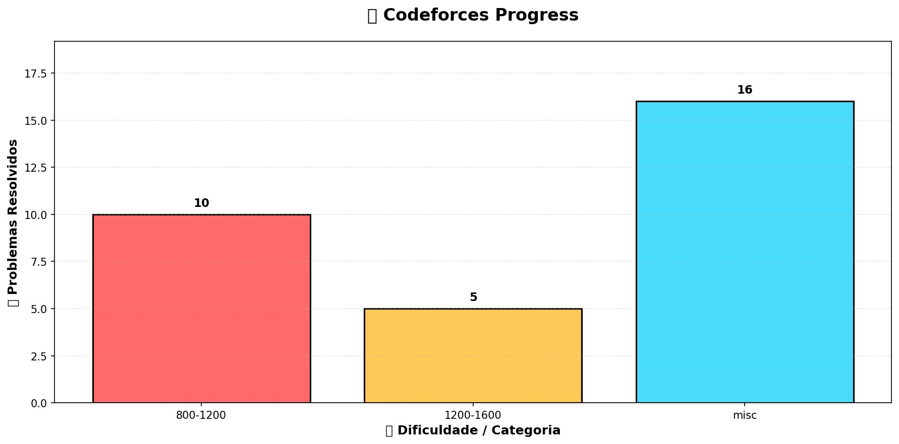

# 🚀 Competitive Programming Repository

Este repositório contém minhas soluções de problemas de programação competitiva, principalmente da plataforma Codeforces

---

# 📁 Estrutura do projeto

Os problemas estão organizados automaticamente por nível de dificuldade (rating):

- 800-1200 → problemas fáceis (fundamentos)
- 1200-1600 → problemas intermediários  
- 1600+ → problemas avançados  

Cada arquivo representa uma solução em Python.

Exemplo de nomes:

1914A.py  
2218F.py  

---

# 🧠 Objetivo

- Praticar algoritmos e estruturas de dados  
- Melhorar raciocínio lógico  
- Evoluir em programação competitiva  
- Acompanhar progresso real por dificuldade  

---

# 📊 Progresso

A imagem abaixo mostra a quantidade de problemas resolvidos por faixa de rating:

---

# ⚙️ Automação

Este repositório possui automação para:

- Contar problemas por pasta  
- Gerar gráfico de progresso automaticamente  
- Atualizar imagem a cada commit  
- Manter organização por rating  

---

# 📈 Evolução

| Faixa | Descrição |
|------|-----------|
| 800 - 1200 | Básico |
| 1200 - 1600 | Intermediário |
| 1600+ | Avançado |

---

# 🤖 Atualização automática

O gráfico `progress.png` é gerado automaticamente via script Python:

- Conta arquivos em cada pasta  
- Gera gráfico com matplotlib  
- Atualiza via GitHub Actions  

---

# 🧑‍💻 Autor

**Thalles Saraiva**
