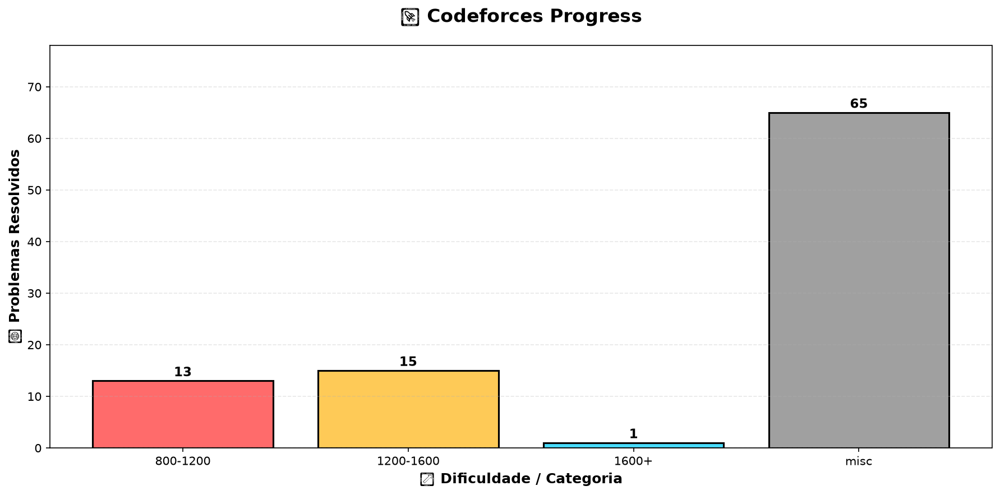

# 🚀 Competitive Programming Repository

Este repositório reúne minhas soluções de problemas de **Programação Competitiva**, principalmente da plataforma **Codeforces**, além de uma coleção de templates para consulta rápida durante as competições.

---

# 📁 Estrutura do Projeto

Os problemas são organizados automaticamente por faixa de dificuldade (rating).

```text
meu-repo/
├── exercises/
│   ├── 800-1200/
│   │   ├── 1914A.py
│   │   └── ...
│   │
│   ├── 1200-1600/
│   │   └── ...
│   │
│   ├── 1600+/
│   │   └── ...
│   │
│   └── misc/
│       └── ...
│
├── notebook/
│   └── topics/
│       ├── 00_entrada_saida.py
│       ├── 01_estruturas_dados.py
│       ├── 02_matematica.py
│       ├── 03_progressoes.py
│       ├── 04_combinatoria.py
│       ├── 05_geometria.py
│       ├── 06_guloso.py
│       ├── 07_backtracking.py
│       ├── 08_dp.py
│       ├── 09_grafos.py
│       ├── 10_dijkstra.py
│       ├── 11_dsu.py
│       ├── 12_kruskal.py
│       ├── 13_topologico.py
│       └── 14_jogos.py
│
├── scripts/
│   └── progress.py
│
├── progress.png
└── README.md
```

---

# 📚 Templates

A pasta `notebook/topics` contém implementações reutilizáveis dos principais algoritmos e estruturas de dados.

| Arquivo | Conteúdo |
|:--------:|-----------|
| [`00_entrada_saida.py`](notebook/topics/00_entrada_saida.py) | Entrada e saída rápida |
| [`01_estruturas_dados.py`](notebook/topics/01_estruturas_dados.py) | Estruturas de dados |
| [`02_matematica.py`](notebook/topics/02_matematica.py) | Matemática básica |
| [`03_progressoes.py`](notebook/topics/03_progressoes.py) | Progressões |
| [`04_combinatoria.py`](notebook/topics/04_combinatoria.py) | Análise combinatória |
| [`05_geometria.py`](notebook/topics/05_geometria.py) | Geometria computacional |
| [`06_guloso.py`](notebook/topics/06_guloso.py) | Algoritmos gulosos |
| [`07_backtracking.py`](notebook/topicss/07_backtracking.py) | Backtracking |
| [`08_dp.py`](notebook/topics/08_dp.py) | Programação dinâmica |
| [`09_grafos.py`](notebook/topics/09_grafos.py) | DFS e BFS |
| [`10_dijkstra.py`](notebook/topics/10_dijkstra.py) | Menor caminho |
| [`11_dsu.py`](notebook/topics/11_dsu.py) | Union-Find (DSU) |
| [`12_kruskal.py`](notebook/topics/12_kruskal.py) | Árvore Geradora Mínima |
| [`13_topologico.py`](notebook/topics/13_topologico.py) | Ordenação topológica |
| [`14_jogos.py`](notebook/topics/14_jogos.py) | Teoria dos jogos |
# 🎯 Objetivos

- Resolver problemas de Programação Competitiva.
- Aprimorar algoritmos e estruturas de dados.
- Evoluir o raciocínio lógico.
- Construir uma biblioteca pessoal de templates.
- Acompanhar meu progresso por nível de dificuldade.

---

# 📊 Progresso

A imagem abaixo mostra a quantidade de problemas resolvidos em cada faixa de rating.

<p align="center">
  
</p>

---

# 📈 Faixas de Rating

| Rating | Nível |
|:------:|:------|
| **800–1200** | Básico |
| **1200–1600** | Intermediário |
| **1600+** | Avançado |

---

# ⚙️ Atualização Automática

O gráfico `progress.png` é gerado automaticamente por um script em Python que:

- conta a quantidade de soluções em cada pasta;
- gera o gráfico com Matplotlib;
- atualiza a imagem via GitHub Actions.

---

# 🛠️ Tecnologias

- Python
- Matplotlib
- GitHub Actions

---

# 👨‍💻 Autor

**Thalles Saraiva**